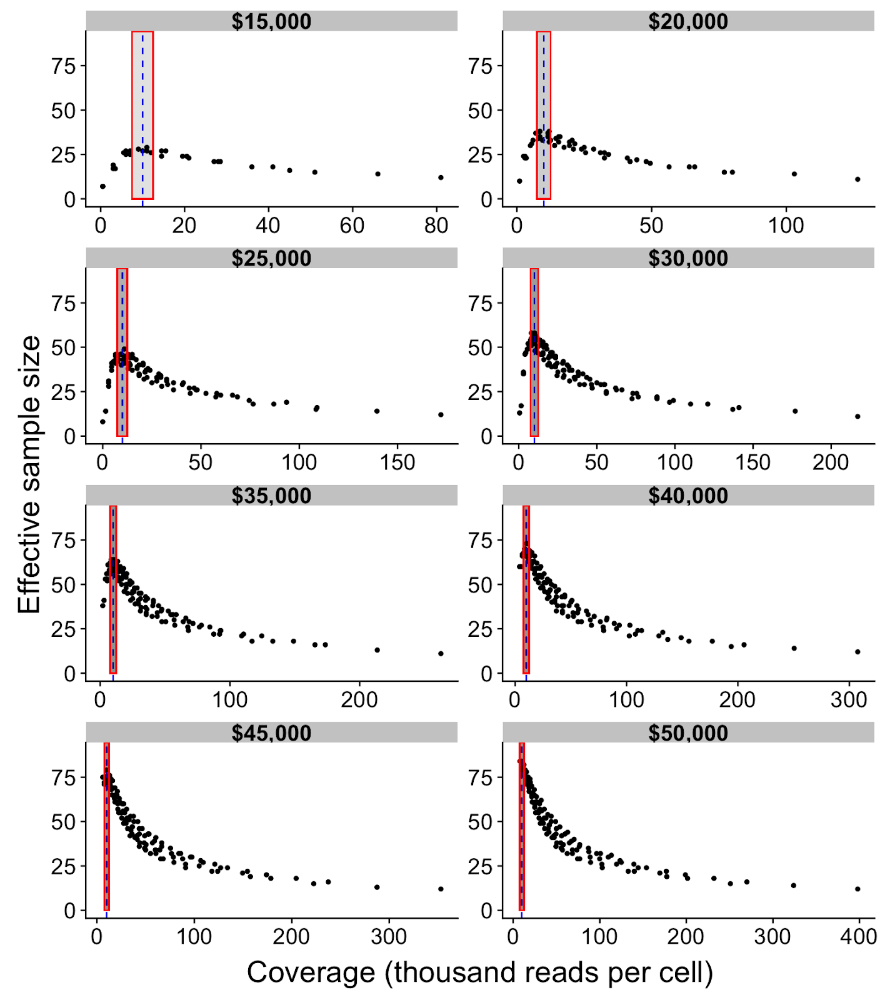

# Optimal design for cell-type specific eQTL studies

This repository contains the code used to analyse the single-cell
RNA-seq datasets shown in:

*Mandric, I., Schwarz, T., Majumdar, A., Hou, k., Bricscoe, L., Perez, R.,
Subramaniam, M., Hafemeister, C., Satija, R., Ye, C., Pasaniuc, B., Halperin, E. (2019) Optimal design of 
single-cell RNA sequencing experiments for cell-type-specific eQTL analysis.
<https://doi.org/10.1101/766972>*

  - [Data availability](#data-availability)
  - [Figure shortcuts](#figure-shortcuts)
  - [Analysis preliminaries](#analysis-preliminaries)
  - [1. Load and hygienize dataset](#1-load-and-hygienize-dataset)
  - [2. Knowledge-based identification of all cell
    populations](#2-knowledge-based-identification-of-all-cell-populations)
  - [3. Population size dynamics](#3-population-size-dynamics)
  - [4. Combinatorial DE tests](#4-combinatorial-de-tests)
  - [5. Neuronal populations
    clustering](#5-neuronal-populations-clustering)
  - [6. Neurogenesis dynamics](#6-neurogenesis-dynamics)
  - [7. Export annotations](#7-export-annotations)
