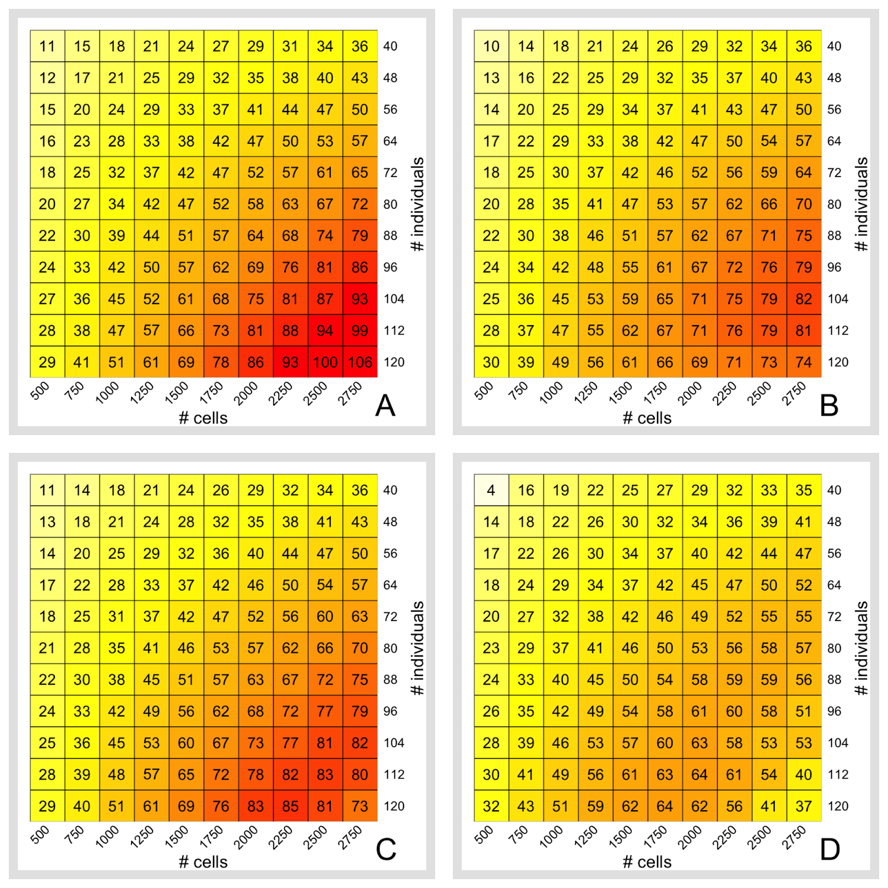
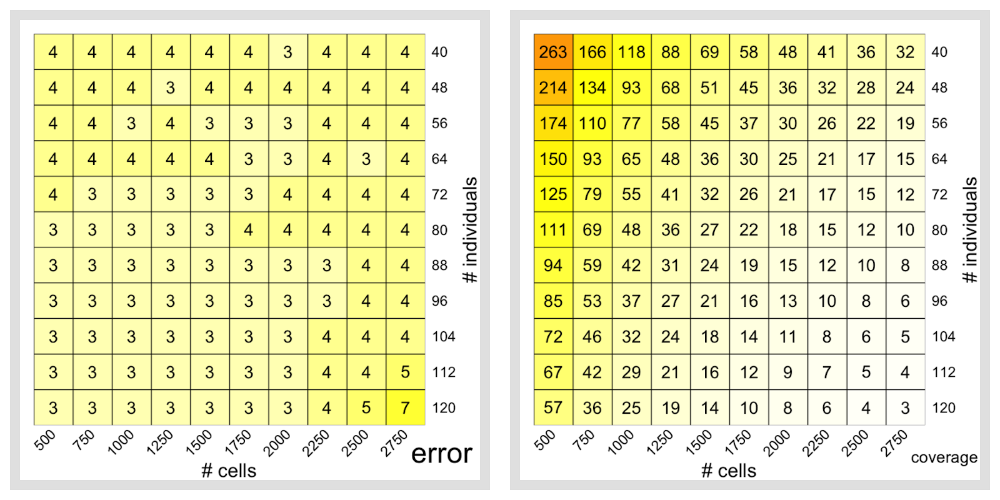
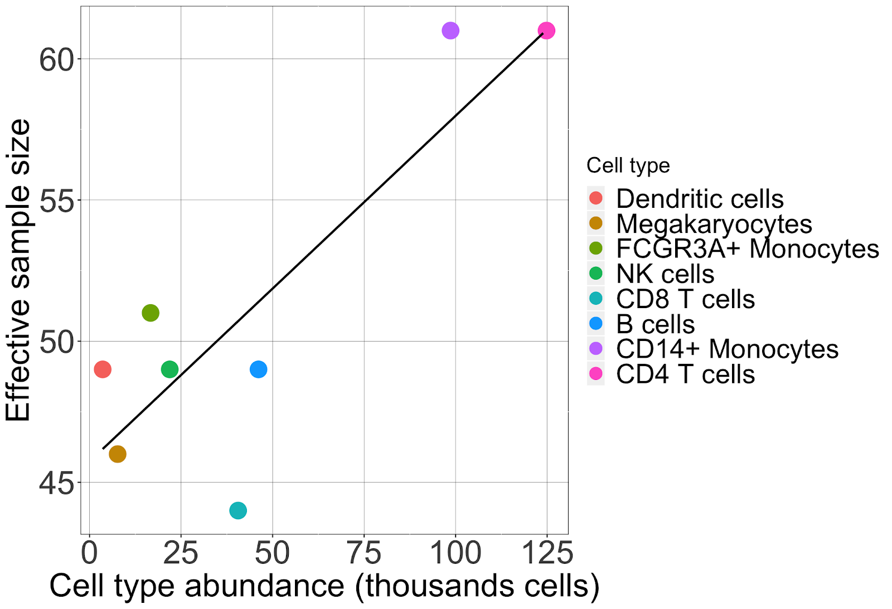
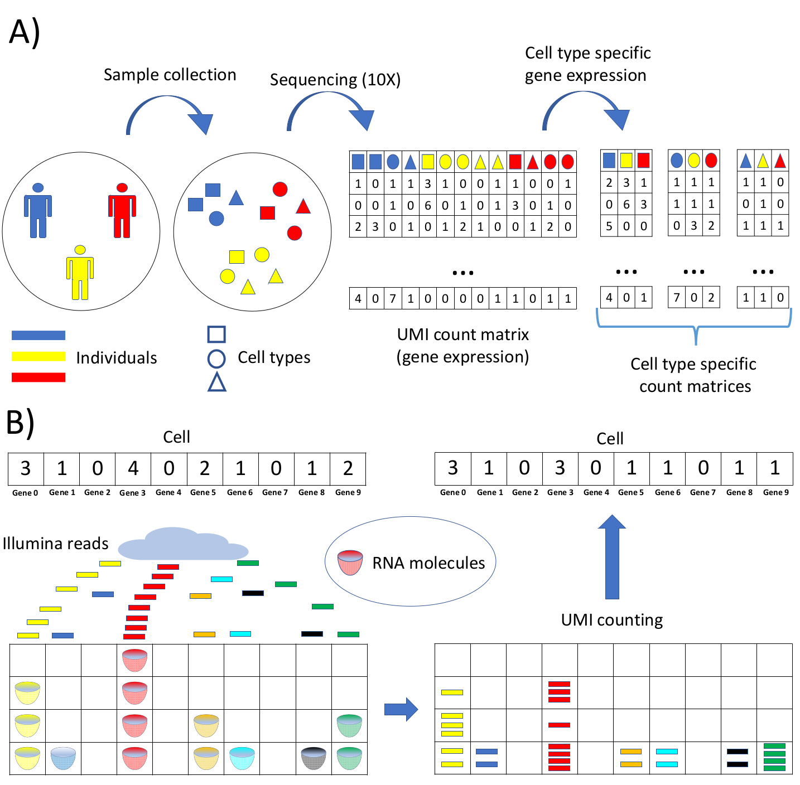

# Optimal design for cell-type specific eQTL studies

This repository contains the code used to analyse the single-cell
RNA-seq datasets shown in:

*Mandric, I., Schwarz, T., Majumdar, A., Hou, k., Bricscoe, L., Perez, R.,
Subramaniam, M., Hafemeister, C., Satija, R., Ye, C., Pasaniuc, B., Halperin, E. (2019) Optimal design of 
single-cell RNA sequencing experiments for cell-type-specific eQTL analysis.
<https://doi.org/10.1101/766972>*

  - [Data availability](#data-availability)
  - [Figures](#figures)
  - [Figure captions](#figure-captions)
  - [Scripts](#scripts)

## Data availability

If you want to analyze the datasets used in the paper, you can access them independently:

  - the [Smart-Seq2 dataset](https://www.ebi.ac.uk/arrayexpress/experiments/E-MTAB-5061/)
    from Segerstolpe et al., 2016.  
  - the [Census of Immune Cells](https://data.humancellatlas.org/explore/projects/cc95ff89-2e68-4a08-a234-480eca21ce79). We analyzed only a subset of it (Lane 7).
  - the [10X dataset](https://www.ncbi.nlm.nih.gov/geo/query/acc.cgi?acc=GSE137029)

## Figures

|                               Figure 1                               |                              Figure 2                              |                     Figure 3                     |                Figure 4                 |
| :------------------------------------------------------------------: | :----------------------------------------------------------------: | :----------------------------------------------: | :-------------------------------------: |
|                                        |                                      |                    |           |
| [Caption](#caption-figure-1)  | [Caption](#caption-figure-2) | [Caption](#caption-figure-3) | [Caption](#caption-figure-4) |

|            Figure 5            |            Figure 6            |                                           Figure 7                                            |                                             Figure S1                                             |
| :----------------------------: | :----------------------------: | :-------------------------------------------------------------------------------------------: | :-----------------------------------------------------------------------------------------------: |
|  |  |                                                                 |                                                                    |
| [Caption](#caption-figure-5)  | [Caption](#caption-figure-s1) | [Caption](#caption-figure-s2) | [Caption](#caption-figure-s3) |

|               Figure S2                |             Figure S3              |                 Figure S4                 |                                          Figure S6                                           |
| :------------------------------------: | :--------------------------------: | :---------------------------------------: | :------------------------------------------------------------------------------------------: |
|         |     |            |                                                               |
| [Caption](#caption-figure-s4)  | [Caption](#caption-figure-s5) | [Caption](#caption-figure-s6) | [Caption](#caption-figure-s7) |

|               Figure S2                |             Figure S3              |                 Figure S4                 |                                          Figure S6                                           |
| :------------------------------------: | :--------------------------------: | :---------------------------------------: | :------------------------------------------------------------------------------------------: |
|         |     |            |                                                               |
| [Caption](#caption-figure-s8)  | [Caption](#caption-figure-s9) | [Caption](#caption-figure-s10) | [Caption](#caption-figure-s11) |

|               Figure S2                |             Figure S3              |                 Figure S4                 |                                          Figure S6                                           |
| :------------------------------------: | :--------------------------------: | :---------------------------------------: | :------------------------------------------------------------------------------------------: |
|         |     |            |                                                               |
| [Caption](#caption-figure-s12)  | [Caption](#caption-figure-s13) | [Caption](#caption-figure-s14) | [Caption](#caption-figure-s15) |

|               Figure S2                |             Figure S3              |                 Figure S4                 |                                          Figure S6                                           |
| :------------------------------------: | :--------------------------------: | :---------------------------------------: | :------------------------------------------------------------------------------------------: |
|         |     |            |                                                               |
| [Caption](#caption-figure-s16)  | [Caption](#caption-figure-s17) | [Caption](#caption-figure-s18) | [Caption](#caption-figure-s19) |

## Figure captions

## Scripts

