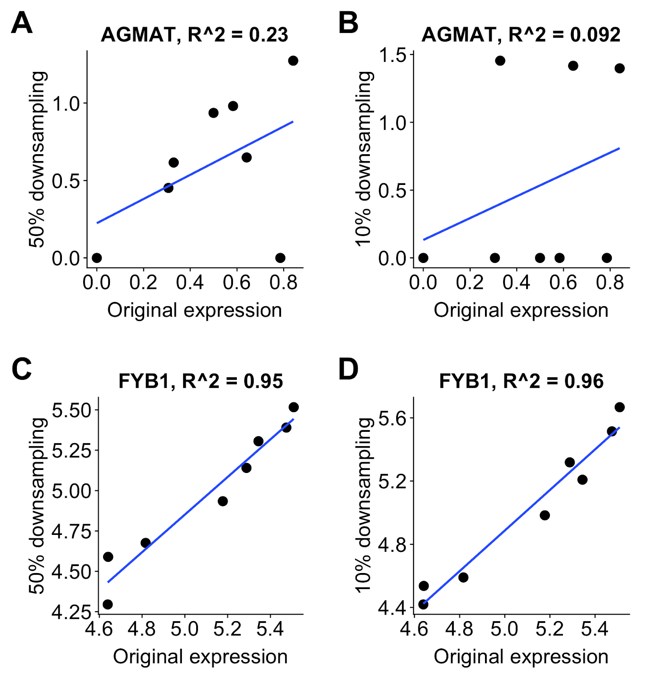

# Optimal design for cell-type specific eQTL studies

This repository contains the code used to analyse the single-cell
RNA-seq datasets shown in:

*Mandric, I., Schwarz, T., Majumdar, A., Hou, k., Bricscoe, L., Perez, R.,
Subramaniam, M., Hafemeister, C., Satija, R., Ye, C., Pasaniuc, B., Halperin, E. (2019) Optimal design of 
single-cell RNA sequencing experiments for cell-type-specific eQTL analysis.
<https://doi.org/10.1101/766972>*

  - [Data availability](#data-availability)
  - [Figure shortcuts](#figure-shortcuts)
  - [Analysis preliminaries](#analysis-preliminaries)
  - [1. Load and hygienize dataset](#1-load-and-hygienize-dataset)
  - [2. Knowledge-based identification of all cell
    populations](#2-knowledge-based-identification-of-all-cell-populations)

# 

## Data availability

# 

If you want to analyze the datasets used in the paper, you can access them independently:

  - the [Smart-Seq2 dataset](https://www.ebi.ac.uk/arrayexpress/experiments/E-MTAB-5061/)
    from Segerstolpe et al., 2016.  
  - the [Census of Immune Cells](https://data.humancellatlas.org/explore/projects/cc95ff89-2e68-4a08-a234-480eca21ce79). We analyzed only a subset of it (Lane 7).
  - the [10X dataset](https://www.ncbi.nlm.nih.gov/geo/query/acc.cgi?acc=GSE137029)

|                               Figure 1                               |                              Figure 2                              |                     Figure 3                     |                Figure 4                 |
| :------------------------------------------------------------------: | :----------------------------------------------------------------: | :----------------------------------------------: | :-------------------------------------: |
|                                        |                                      |                    |           |
| [B](#step-1-map) [C](#tsne-plots) [D-E](#progenitor-and-neuron-maps) | [A-D](#population-ratio-dynamics) [E](#population-size-comparison) | [A](#gene-categories-highlights) [B](#claudin-3) | [A](#5-neuronal-populations-clustering) |

|            Figure 5            |            Figure 6            |                                           Figure 7                                            |                                             Figure S1                                             |
| :----------------------------: | :----------------------------: | :-------------------------------------------------------------------------------------------: | :-----------------------------------------------------------------------------------------------: |
|  |  |                                                                 |                                                                    |
| [A](#gene-levels-per-subtypes) |    [A](#neurogenesis-waves)    | [A-B](#differentiation-plane) [C](#plot-neurogenesis-pattern) [D](#genes-profiles-per-domain) | [A-C](#1-load-and-hygienize-dataset) [D](#doublet-estimation) [E-F](#tsne-plots) [G](#step-2-map) |

|               Figure S2                |             Figure S3              |                 Figure S4                 |                                          Figure S6                                           |
| :------------------------------------: | :--------------------------------: | :---------------------------------------: | :------------------------------------------------------------------------------------------: |
|         |     |            |                                                               |
| [A](#progenitor-patterning-prediction) | [A](#neuron-patterning-prediction) | [A-H](#5-neuronal-populations-clustering) | [A](#identify-gliogenic-and-neurogenic-pan-domain-modules) [B-D](#genes-profiles-per-domain) |
