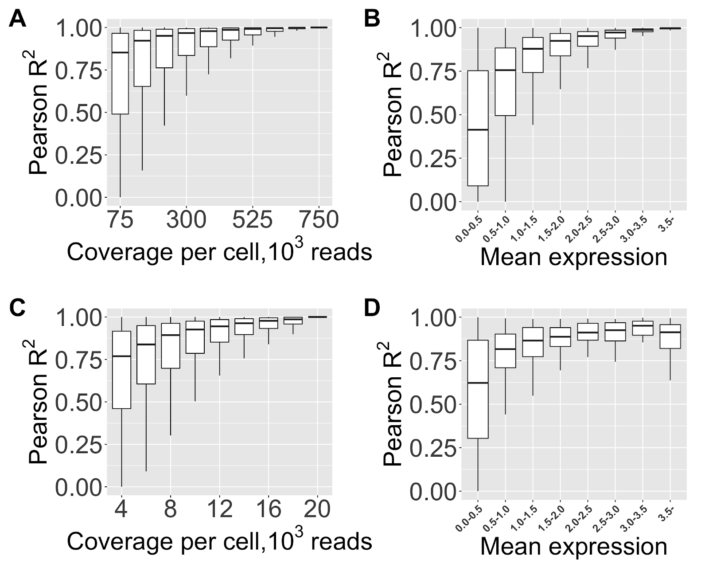
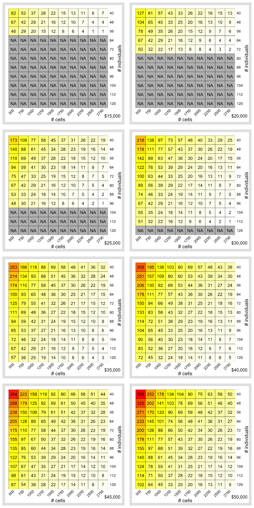
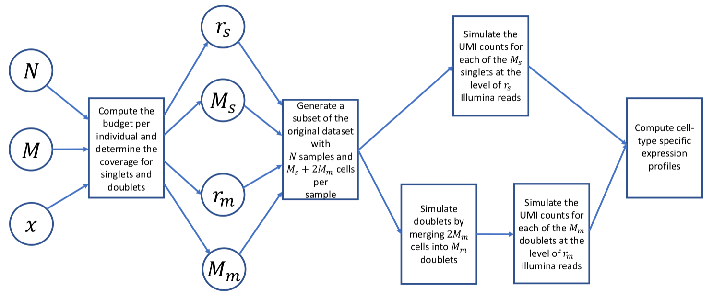

# Optimal design for cell-type specific eQTL studies

This repository contains the code used to analyse the single-cell
RNA-seq datasets shown in:

*Mandric, I., Schwarz, T., Majumdar, A., Hou, k., Bricscoe, L., Perez, R.,
Subramaniam, M., Hafemeister, C., Satija, R., Ye, C., Pasaniuc, B., Halperin, E. (2019) Optimal design of 
single-cell RNA sequencing experiments for cell-type-specific eQTL analysis.
<https://doi.org/10.1101/766972>*

  - [Data availability](#data-availability)
  - [Figures](#figures)
  - [Figure captions](#figure-captions)
  - [ct-eQTL design calculator](#ct-eqtl-design-calculator)

## Data availability

If you want to analyze the datasets used in the paper, you can access them independently:

  - the [Smart-Seq2 dataset](https://www.ebi.ac.uk/arrayexpress/experiments/E-MTAB-5061/)
    from Segerstolpe et al., 2016.  
  - the [Census of Immune Cells](https://data.humancellatlas.org/explore/projects/cc95ff89-2e68-4a08-a234-480eca21ce79). We analyzed only a subset of it (Lane 7).
  - the [10X dataset](https://www.ncbi.nlm.nih.gov/geo/query/acc.cgi?acc=GSE137029)

## Figures

|                               Figure 1                               |                              Figure 2                              |                     Figure 3                     |                Figure 4                 |
| :------------------------------------------------------------------: | :----------------------------------------------------------------: | :----------------------------------------------: | :-------------------------------------: |
|                                        |                                      |                    |           |
| [Caption](#caption-figure-1), [Script](./plots/figure1.R)  | [Caption](#caption-figure-2), [Script](./plots/figure2.R) | [Caption](#caption-figure-3), [Script](./plots/figure3.R) | [Caption](#caption-figure-4) |

|            Figure 5            |            Figure S1            |                                           Figure S2                                            |                                             Figure S3                                             |
| :----------------------------: | :----------------------------: | :-------------------------------------------------------------------------------------------: | :-----------------------------------------------------------------------------------------------: |
|  |  |                                                                 |                                                                    |
| [Caption](#caption-figure-5)  | [Caption](#caption-figure-s1) | [Caption](#caption-figure-s2), [Script](./plots/allplots.R) | [Caption](#caption-figure-s3) |

|               Figure S4                |             Figure S5              |                 Figure S6                 |                                          Figure S7                                           |
| :------------------------------------: | :--------------------------------: | :---------------------------------------: | :------------------------------------------------------------------------------------------: |
|         |     |            |                                                               |
| [Caption](#caption-figure-s4)  | [Caption](#caption-figure-s5) | [Caption](#caption-figure-s6) | [Caption](#caption-figure-s7) |

|               Figure S8                |             Figure S9              |                 Figure S10                 |                                          Figure S11                                           |
| :------------------------------------: | :--------------------------------: | :---------------------------------------: | :------------------------------------------------------------------------------------------: |
|         |     |            |                                                               |
| [Caption](#caption-figure-s8)  | [Caption](#caption-figure-s9) | [Caption](#caption-figure-s10) | [Caption](#caption-figure-s11) |

|               Figure S12                |             Figure S13              |                 Figure S14                 |                                          Figure S15                                           |
| :------------------------------------: | :--------------------------------: | :---------------------------------------: | :------------------------------------------------------------------------------------------: |
|         |     |            |                                                               |
| [Caption](#caption-figure-s12)  | [Caption](#caption-figure-s13) | [Caption](#caption-figure-s14) | [Caption](#caption-figure-s15) |

|               Figure S16                |             Figure S17              |                 Figure S18                 |                                          Figure S19                                           |
| :------------------------------------: | :--------------------------------: | :---------------------------------------: | :------------------------------------------------------------------------------------------: |
|         |     |            |                                                               |
| [Caption](#caption-figure-s16)  | [Caption](#caption-figure-s17) | [Caption](#caption-figure-s18) | [Caption](#caption-figure-s19) |

## Figure captions

| 
 <h5 id="caption-figure-1">Caption Figure 1</h5> 
 |
| :------------------------------------: |
| The impact of read coverage on the average R2 between cell-type-specific gene expression estimates and their high-coverage values (Smart-Seq2 dataset, alpha cells).  A) Distribution of Pearson R2 computed across all the genes at different levels of read coverage, Smart-Seq2 dataset. B) Distribution of Pearson R2 at 75,000 reads per cell stratified by the expression level, Smart-Seq2 dataset. C) Distribution of Pearson R2 computed across all the genes at different levels of read coverage, 10X dataset. D) Distribution of Pearson R2 at 4,000 reads per cell stratified by the expression level, 10X dataset. |
| 
 <h5 id="caption-figure-2">Caption Figure 2</h5> 
 |
| Effective sample size computed across a grid of experimental designs with sample size N ranging from 40 to 120 individuals in steps of 8 and the number of cells per individuals M ranging from 500 to 2,750 cells per individual in steps of 250 (CD4 T cells).  A) Library preparation is assumed to be 0$ per reaction, level of multiplexing is fixed and equal to 8. B) Library preparation is set to $2000 per reaction, level of multiplexing is fixed and equal to 8. C) Library preparation is set to $2000 per reaction, greedy multiplexing. D) Library preparation is set to $2000 per reaction, greedy multiplexing, demultiplexing inaccuracy and cell-type misclassification is taken into account. |
| 
 <h5 id="caption-figure-3">Caption Figure 3</h5> 
 |
| Cell-type misclassification error rate (%) and coverage (thousands of reads per cell) for different experimental designs.  A) Cell-type misclassification error; B) Coverage. |
| 
 <h5 id="caption-figure-4">Caption Figure 4</h5> 
 |
| Experimental designs for CD4 T cells ct-eQTL with effective sample size Neff=40: A) Comparison of different experimental designs. Experimental design N=88, M=2,250, r=4,500 yields two-fold reduction in cost than the standard design. B) For a fixed sample size and number of cells per individual, increasing coverage implies increasing the effective sample size (i.e., power) only up to a point. There is little gain in power at coverages greater than 12,500 reads per cell. |
| 
 <h5 id="caption-figure-5">Caption Figure 5</h5> 
 |
| Effective sample size as a function of cell-type prevalence. Shown here is the effective sample size across the grid of experimental design when the cell-type abundance is set to different values - 5, 10, 15, 20, 25, 30%.  (CD4 T cells at fixed budget $35,000). |
| 
 <h5 id="caption-figure-6">Caption Figure 6</h5> 
 |
| Performance of ct-eQTL analysis. Shown here is recall (power estimate) as a function of coverage in the ct-eQTL analysis of CD4 T cells at fixed budget $35,000. A) Mean ct-eQTL; B) Variance ct-eQTL. |
| 
 <h5 id="caption-figure-s1">Caption Figure S1</h5> 
 |
| Pearson R2 between low-coverage estimates and the high-coverage gene expression in Smart-Seq2 dataset. A) SLC14A2 gene, 50% downsampling (375,000 reads per cell); B) SLC14A2 gene, 10% downsampling (75,000 reads per cell); C) GCG gene, 50% downsampling (375,000 reads per cell); D) GCG gene, 10% downsampling (75,000 reads per cell). |
| 
 <h5 id="caption-figure-s2">Caption Figure S2</h5> 
 |
| Stratification of genes based on the number of individuals they are expressed in (Smart-Seq2 dataset). A) Distribution of genes by the number of individuals they are expressed in, Smart-Seq2 dataset. B) Average Pearson R2 at 75,000 reads per cell (alpha cells) stratified by the number of individuals they are expressed in, Smart-Seq2 dataset (vertical bars indicate interquartile range). C) Distribution of genes by the number of individuals they are expressed in, 10X dataset (The Census of Immune Cells). D) Average Pearson R2 at 4,000 reads per cell (erythroblast cells) stratified by the number of individuals they are expressed in, 10X dataset (The Census of Immune Cells) (vertical bars indicate interquartile range). |
| 
 <h5 id="caption-figure-s3">Caption Figure S3</h5> 
 |
| Pearson R2 between low-coverage estimates and the high-coverage gene expression in a 10X dataset (subset of the Census of Immune cells). A) AGMAT gene, 50% downsampling (10,000 reads per cell); B) AGMAT gene, 10% downsampling (2,000 reads per cell); C) FYB1 gene, 50% downsampling (10,000 reads per cell); D) FYB1 gene, 10% downsampling (2,000 reads per cell). |
| 
 <h5 id="caption-figure-s3">Caption Figure S3</h5> 
 |

| Pearson R2 between low-coverage estimates and the ground truth gene expression in a 10X dataset (subset of the Census of Immune cells). A) AGMAT gene, 50% downsampling (10,000 reads per cell); B) AGMAT gene, 10% downsampling (2,000 reads per cell); C) FYB1 gene, 50% downsampling (10,000 reads per cell); D) FYB1 gene, 10% downsampling (2,000 reads per cell). | 
| 
 <h5 id="caption-figure-s4">Caption Figure S4</h5> 
 |
| Effective sample size as a function of number of individuals and number of cells per individual at budget $35,000 assuming no library preparation cost, multiplexing of 8 individuals per reaction, and known cell types. The dependence on read coverage is implicit. The maximum effective size Neff is a) 105 for B cells (N=120, M=2,750, r =14,500); b) 108 for CD14+ cells (N=120, M=2,750, r =14,500); c) 107 for CD4+ cells (N=120, M=2,750, r =14,500); d) 105 for CD8+ cells (N=120, M=2,750, r =14,500); e) 102 for dendritic cells (N=120, M=2,750, r =14,500); f) 106 for Fcgr3a cells (N=120, M=2,750, r =14,500); g) 105 for megakaryocytes (N=120, M=2,750, r =14,500); h) 106 for NK cells (N=120, M=2,750, r =14,500). |
| 
 <h5 id="caption-figure-s5">Caption Figure S5</h5> 
 |
| Effective sample size as a function of number of individuals and number of cells per individual at budget $35,000 assuming library preparation costs of $2,000 per reaction, multiplexing of 8 individuals per reaction, known cell types. The maximum effective size Neff is a) 81 for B cells (N=104, M=2,750, r =4,300); b) 82 for CD14+ cells (N=104, M=2,750, r =4,300); c) 82 for CD4+ cells (N=104, M=2,750, r =4,300); d) 82 for CD8+ cells (N=104, M=2,750, r =4,300); e) 67 for dendritic cells (N=96, M=2,750, r =5,700); f) 73 for Fcgr3a cells (N=96, M=2,750, r =5,700); g) 77 for megakaryocytes (N=104, M=2,750, r =4,300); h) 86 for NK cells (N=112, M=2,750, r =3,100). |
| 
 <h5 id="caption-figure-s6">Caption Figure S6</h5> 
 |
| Effective sample size as a function of number of individuals and number of cells per individual at budget $35,000 assuming library preparation costs of $2,000 per reaction, greedy multiplexing (up to 16 individuals per reaction), and known cell types. The level of multiplexing takes on values from 8 to 16. The maximum effective size Neff is a) 83 for B cells (N=120, M=2,250, r =5,400); b) 86 for CD14+ cells (N=120, M=2,250, r =5,400); c) 86 for CD4+ cells (N=120, M=2,250, r =5,400); d) 83 for CD8+ cells (N=120, M=2,250, r =5,400); e) 70 for dendritic cells (N=120, M=2,000, r =8,000); f) 76 for Fcgr3a cells (N=120, M=2,250, r =5,400); g) 79 for megakaryocytes (N=120, M=2,250, r =5,400); h) 86 for NK cells (N=120, M=2,250, r =5,400). |
| 
 <h5 id="caption-figure-s7">Caption Figure S7</h5> 
 |
| Effective sample size as a function of number of individuals and number of cells per individual at budget $35,000 assuming library preparation costs of $2,000 per reaction, greedy multiplexing (up to 16 individuals per reaction) and unknown cell types. Demultiplexing inaccuracy at low coverage is taken into account. Cell types are inferred using Seurat’s label transfer procedure. The maximum effective size Neff is a) 52 for B cells (N=104, M=2,000, r =10,500); b) 64 for CD14+ cells (N=112, M=2,000, r =8,500); c) 64 for CD4+ cells (N=120, M=1,750, r =9,500); d) 47 for CD8+ cells (N=112, M=2,000, r =8,500); e) 49 for dendritic cells (N=96, M=2,000, r =12,500); f) 52 for Fcgr3a cells (N=104, M=2,000, r =10,500); g) 49 for megakaryocytes (N=120, M=2,000, r =7,500); h) 51 for NK cells (N=104, M=2,000, r=10,500). |
| 
 <h5 id="caption-figure-s8">Caption Figure S8</h5> 
 |
| Cell-type misclassification rate (in %) across different budgets assuming library preparation costs of $2,000 per reaction and greedy multiplexing. Demultiplexing inaccuracy at low coverage is taken into account. |
| 
 <h5 id="caption-figure-s9">Caption Figure S9</h5> 
 |
| Coverage (thousands of reads per cell) across different budgets assuming library preparation costs of $2,000 per reaction and greedy multiplexing (with at most 24,000 cells per reaction). |
| 
 <h5 id="caption-figure-s10">Caption Figure S10</h5> 
 |
| Effective sample size for CD4 T cells across different budgets assuming library preparation costs of $2,000 per reaction and greedy multiplexing. Demultiplexing inaccuracy at low coverage is taken into account.  |
| 
 <h5 id="caption-figure-s11">Caption Figure S11</h5> 
 |
| Effective sample size for CD4 T cells as a function of sample size across different cell types at $35,000. The cell types are sorted by their abundances. |
| 
 <h5 id="caption-figure-s12">Caption Figure S12</h5> 
 |
| R2 between cell type abundances and the effective sample size (N = 96, B = $35,000). |
| 
 <h5 id="caption-figure-s13">Caption Figure S13</h5> 
 |
| Average coverage across top 3 most powerful ct-eQTL studies as a function of budget. Coverage corresponding to the experiments with the highest effective sample size (in the search space defined in the main text of the paper) is 10,000  2,500 reads per cell. |
| 
 <h5 id="caption-figure-s14">Caption Figure S14</h5> 
 |
| Effective sample size as a function of read coverage (CD4 T cells). The optimal effective sample size is achieved at 10,000  2,500 reads per cell. Each dot represents an experiment, the grey strip delimits the optimal coverage, i.e. the coverage at which the highest effective sample size is achieved. |
| 
 <h5 id="caption-figure-s15">Caption Figure S15</h5> 
 |
| Power estimates in ct-eQTL studies (CD4 T cells) stratified by sample size. A) Recall (power estimate) as a function of effective sample size. B) Precision-recall plot. |
| 
 <h5 id="caption-figure-s16">Caption Figure S16</h5> 
 |
| The simulation workflow. The input to the simulation are the parameters N- the sample size, M- the number of cells per sample, x - multiplexing level. We first compute the budget per each individual. Then, by using the Satija lab single-cell cost calculator (https://satijalab.org/costpercell) we compute the number of singlets Ms with the coverage rs and the number of multiplets Mm with the coverage rm. We then randomly “merge” the expression profiles of 2Mmcells pair-wise to obtain Mm doublets. Finally, the reads are simulated from each cell and the cell-type specific expression is computed for each cell type across all of the samples. |
| 
 <h5 id="caption-figure-s17">Caption Figure S17</h5> 
 |
| Percent of total detected UMIs at different levels of coverage. At each level of coverage r, we randomly sampled a cell from the 10X dataset and simulated r reads. The average number of recovered UMIs per cell is computed over 1000 iterations. |
| 
 <h5 id="caption-figure-s18">Caption Figure S18</h5> 
 |
| Read count simulation for 10X. A) First, samples are collected, then sequenced by using 10X Genomics technology. Second, cell-type-specific gene expression is determined for each of the individuals. B) Each RNA molecule (or, equivalently, each UMI) regardless of the gene it was transcribed from is an urn, and each Illumina read is a ball which is randomly thrown into the urns. Given the ground truth expression of a cell (on the left) as the number of RNA molecules in the ground truth, the simulation of gene expression under a specified level of read coverage is performed as a random throwing of reads (“balls”) into the corresponding RNA molecules (“urns”). After all the “balls” are thrown into the “urns”, some urns remain empty (the gene received 0 reads, consequently, was not sequenced). In case a small number of reads is thrown into the “urns”, a considerable number of so-called “drop-out” events (i.e., missing all UMIs from a gene) will occur. |
| 
 <h5 id="caption-figure-s19">Caption Figure S19</h5> 
 |
| cell type composition of the 10X dataset. |

## ct-eQTL design calculator

The calculator for the design of single-cell RNA-Seq experiments for cell-type-specific eQTL studies is available [HERE](https://mandricigor.github.io/ct-eqtl-design/).

